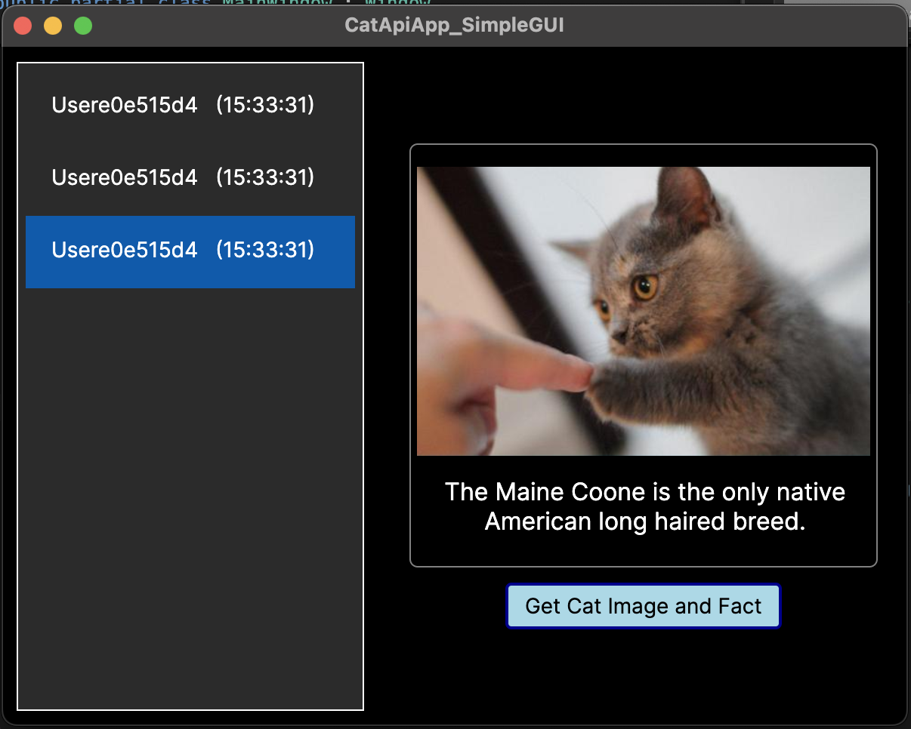
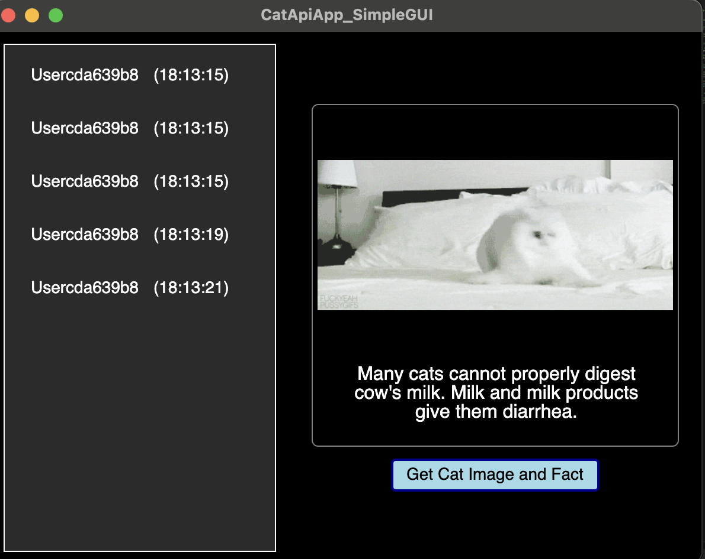

# CatApiApp_SimpleGUI

**CatApiApp_SimpleGUI** is a graphical user interface (GUI) application designed to fetch and display random cat images and facts. It utilizes APIs for cat data and incorporates a simple, user-friendly interface. The application is built using C# and Avalonia, adhering to the MVVM (Model-View-ViewModel) design pattern for a clean and maintainable architecture.

## Example Cat Images ##

<p align="center">
  
  
</p>

<p align="center">
  <strong>Cat Image 1</strong> &nbsp;&nbsp;&nbsp;&nbsp;&nbsp; <strong>Cat Image 2</strong>
</p>

### Description:
On the left, **Cat Image 1** is an example of the app using dummy data for both images and facts. On the right, **Cat Image 2** shows the app with extra data and different cat images. This demonstrates how the app can handle various sets of information and still maintain its layout and functionality.


## Features

- Fetch random cat images from [The Cat API](https://thecatapi.com/).
- Retrieve random cat facts from [Cat Facts API](https://catfact.ninja/).
- Display fetched cat images and facts in a simple GUI.
- Save user interaction data, including cat images and facts, in a local file for future reference.

## Getting Started

### Prerequisites

- [.NET SDK](https://dotnet.microsoft.com/download) (Ensure that .NET Core is installed to build and run the project.)
- [AvaloniaUI](https://avaloniaui.net/) (Required to run the GUI application.)

### Installation

1. Clone the repository:
   ```bash
   git clone https://github.com/yourusername/CatApiApp_SimpleGUI.git
   ```


2. Navigate to the project directory:
   ```cd CatApiApp_SimpleGUI ```

3. Restore dependencies and build the application:
   ``` dotnet restore dotnet build ```

5. Navigate to the project directory:
   ``` Run the application ```

## Folder Structure
```bash

CatApiApp_SimpleGUI/
│
├── Models/
│   └── CatData.cs            # Model for cat data (image, fact, user info).
│
├── Services/
│   ├── CatService.cs         # Service for fetching cat images and facts from APIs.
│   └── FileService.cs        # Service for saving and reading cat data to/from files.
│
├── ViewModels/
│   ├── MainWindowViewModel.cs  # ViewModel for managing cat data and UI logic.
│   └── ViewModelBase.cs        # Base ViewModel for property change notifications.
│
├── Views/
│   ├── MainWindow.axaml       # XAML for the main window layout.
│   └── MainWindow.axaml.cs    # Code-behind for user interactions in the main window.
│
├── App.axaml                 # Application-wide XAML file.
├── App.axaml.cs              # Code-behind for application-level logic.
├── Program.cs                # Entry point for the application with DI setup.
└── CatApiApp_SimpleGUI.csproj # Project file for the application.
```

## Project Structure

### Models
- **CatData.cs**: Defines the structure for cat data, including the image URL, fact, user name, and timestamp.

### Services
- **CatService.cs**: Contains methods to fetch random cat images and facts from external APIs.
- **FileService.cs**: Handles saving and reading cat data to/from local files.

### ViewModels
- **MainWindowViewModel.cs**: Manages the logic for fetching cat data and updating the UI.
- **ViewModelBase.cs**: Provides base functionality for notifying the UI of property changes.

### Views
- **MainWindow.axaml**: The layout of the main window (UI).
- **MainWindow.axaml.cs**: Handles user interaction in the main window, such as fetching and displaying cat data.

## References

0. The people I collaborated with during the project
1. [The Cat API](https://thecatapi.com/)
2. [Cat Facts API](https://catfact.ninja/)
3. [AvaloniaUI Documentation](https://docs.avaloniaui.net/)
4. [MVVM Design Pattern](https://learn.microsoft.com/en-us/windows/communitytoolkit/mvvm/introduction)
5. Github and various resources online

6. GPT-4-turbo, for guidance and assistance throughout the development process

